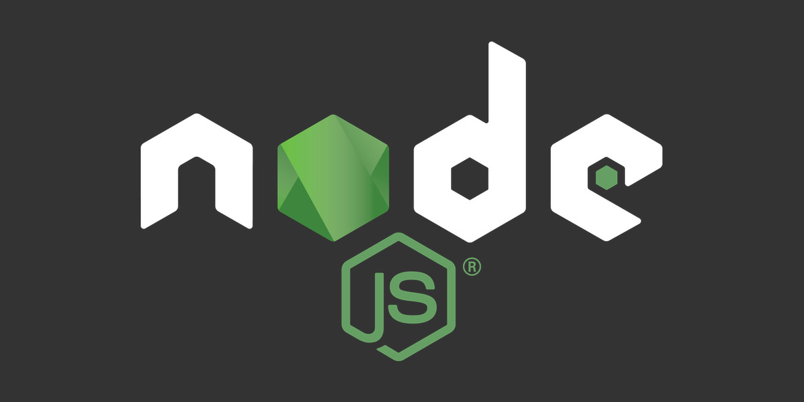

# Ignite - Task Management (API)

Este é um projeto de desafio das aulas da Rocketseat de Fundamentos de NodeJS. Ele tem por objetivo ser uma API de CRUD de tasks.

## Funcionalidades

- [x] Criação de uma task
- [x] Listagem de todas as tasks
- [x] Atualização de uma task pelo `id`
- [x] Remover uma task pelo `id`
- [x] Marcar pelo `id` uma task como completa
- [x] Importação de tasks em massa por um arquivo CSV

## Estrutura das Tasks

A estrutura de uma task contém:

- `id` - Identificador único de cada task
- `title` - Título da task
- `description` - Descrição detalhada da task
- `completed_at` - Data de quando a task foi concluída. O valor inicial deve ser `null`
- `created_at` - Data de quando a task foi criada.
- `updated_at` - Deve ser sempre alterado para a data de quando a task foi atualizada.

Rotas:

- `POST - /tasks`
  Deve ser possível criar uma task no banco de dados, enviando os campos `title` e `description` por meio do `body` da requisição.
  Ao criar uma task, os campos: `id`, `created_at`, `updated_at` e `completed_at` devem ser preenchidos automaticamente, conforme a orientação das propriedades acima.
- `GET - /tasks`
  Deve ser possível listar todas as tasks salvas no banco de dados.
  Também deve ser possível realizar uma busca, filtrando as tasks pelo `title` e `description`
- `PUT - /tasks/:id`
  Deve ser possível atualizar uma task pelo `id`.
  No `body` da requisição, deve receber somente o `title` e/ou `description` para serem atualizados.
  Se for enviado somente o `title`, significa que o `description` não pode ser atualizado e vice-versa.
  Antes de realizar a atualização, deve ser feito uma validação se o `id` pertence a uma task salva no banco de dados.
- `DELETE - /tasks/:id`
  Deve ser possível remover uma task pelo `id`.
  Antes de realizar a remoção, deve ser feito uma validação se o `id` pertence a uma task salva no banco de dados.
- `PATCH - /tasks/:id/complete`
  Deve ser possível marcar a task como completa ou não. Isso significa que se a task estiver concluída, deve voltar ao seu estado “normal”.
  Antes da alteração, deve ser feito uma validação se o `id` pertence a uma task salva no banco de dados.

## Execussão do Projeto

Primeiro instale as dependências:

```
yarn
```

Depois execute o projeto da api

```
yarn start
```

Para experimentar o load de dados do csv, basta executar o comando:

```
yarn load
```
